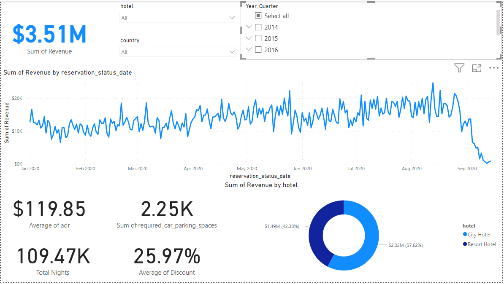

# Hotel Revenue Data Analysis

In this case we want develop a dashboard that can show as that our hotel is growing or not?
should we increase our parking lot size?
what trend can we see in the data?

## Data

We have an Excel File that we first of all make it the several CSV and then we start analysis on it using MySQl.
some of important information about our dataset:
we have two hotel type so it would be good to segment revenue by hotel type.
we want to understand if there is a trend is guest with personal cars.
focuse on avrage daily rate and guests to explore seasonality.

## What was our goal?

We want develop a database to analyze and visualize Hotel booking data.

## what we do on this project?

1. build a data base
2. develop the sql query
3. connect power bi to the database
4. visualize
5. summarize findings

## Dashboard

