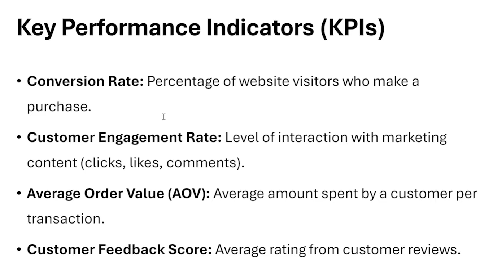
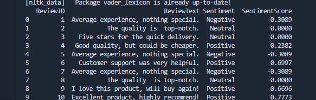
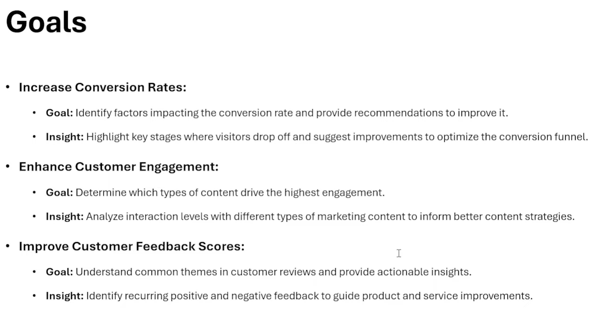
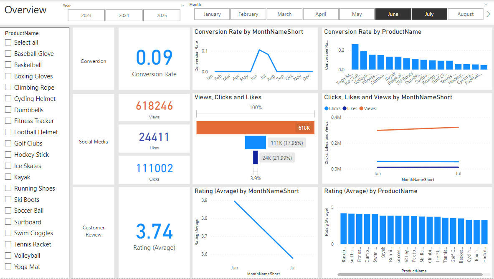

# Marketing Data Analysis

In this project we look at the Marketing Data. The data are from a shop that sell the Sport stuff.
so, we analysis the data in the MySQL, then make NLP on the data and extract the csv file ('fact_customer_review_with_sentiment') using Python and at the end we make a Dashboard using PowerBI.

## Data

Our Dataset contain some important information. we had information about customers, their journey on our shop, their review of our Sport stuff, Geography, Likes, Clicks, Views, also we had a dataset about our product.

In this case at the first step we should make EDA on our Dataset to extract meaningful information and their Relationship with other Datasets. Even if we need, we make new dataset from two or more table on MySql.

As i mention we do all of this thing in the MySQL. We make Database, import Tables, EDA, Joins and Etc.
For Example:

```sql
WITH DuplicateRecords AS (
    SELECT
        JourneyID,
        CustomerID,
        ProductID,
        VisitDate,
        Stage,
        Action,
        Duration,

        ROW_NUMBER() OVER (

            PARTITION BY CustomerID, ProductID, VisitDate, Stage, Action

            ORDER BY JourneyID
        ) AS row_num
    FROM
        dbo.customer_journey
)

-- Select all records from the CTE where row_num > 1, which indicates duplicate entries

SELECT *
FROM DuplicateRecords
WHERE row_num > 1
ORDER BY JourneyID

-- Outer query selects the final cleaned and standardized data

SELECT
    JourneyID,
    CustomerID,
    ProductID,
    VisitDate,
    Stage,
    Action,
    COALESCE(Duration, avg_duration) AS Duration  -- Replaces missing durations with the average duration for the corresponding date
FROM
    (
        -- Subquery to process and clean the data
        SELECT
            JourneyID,
            CustomerID,
            ProductID,
            VisitDate,
            UPPER(Stage) AS Stage,
            Action,
            Duration,
            AVG(Duration) OVER (PARTITION BY VisitDate) AS avg_duration,
            ROW_NUMBER() OVER (
                PARTITION BY CustomerID, ProductID, VisitDate, UPPER(Stage), Action
                ORDER BY JourneyID
            ) AS row_num
        FROM
            dbo.customer_journey
    ) AS subquery
WHERE
    row_num = 1;
```

I do this to remove the duplicated data from my table.
Or i Normalize my engagement_data Table like this:

```sql
Select
	EngagementID,
	ContentID,
	CampaignID,
	ProductID,
	Upper(Replace(ContentType, 'Socialmedia', 'Social Media')) As ContentType,
	Left(ViewsClicksCombined, CHARINDEX('-', ViewsClicksCombined) - 1) As Views,
	Right(ViewsClicksCombined, Len(ViewsClicksCombined) - CHARINDEX('-', ViewsClicksCombined)) As Clicks,
	Likes,
	Format(Convert(DATE, EngagementDate), 'dd.MM.yyyy') As EngagmentDate
From
	dbo.engagement_data
Where
	ContentType != 'Newsletter';
```

## What was our duty?


## KPIs



## Sentiment Analysis

As you can see on the Kpi, we want know the sentiment of our customer and their rating to improve our factory and commodity. To do that i use the Python and Nltk library. I made some function to get the data, clean it, make NLP, then save it as a CSV file to use that in the PowerBI.

This is a output from my code:



Also you can see a plot of this code:


You can use my code by:

```bash
pip install -r requirements.txt
```

## What was our Goal from this process?



## Dashboard

At the end i make a dashboard to visulize my information. You can open it in the dashboard/marketingdashboard.pbix.
some image of my dashboard.

You can see you can filter the data by year, month and product in my dashboard. in this image you can see some general information from the data but in the next image i analysis one by one to achive our goals.

Social Media Detail:


Customer Review:


Conversion Detail:

